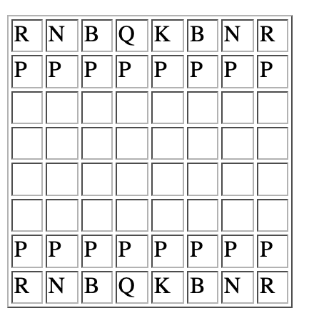

# chess-game

### Problem Statement

Chess is a board game of two players. Player could be human or computer. There are two sides of pieces in chess game. One is black and another one is white. A player chooses one of them and plays with that side.

Each side of pieces contains total 16 including 1 king, 1 queen, 2 bishops, 2 knights, 2 rooks and 8 pawns.

First board is initialized according to its standard initial position of pieces.
Each player gets his turn and makes valid move of his side piece and gives turn to opponent.

Checkmate of either side king is considered the end of game. In time limit game, either timeout or checkmate is considered as the end of game. Time limit game requires to maintain time watch of the two players.

### Usecases

* Chess board is initialized to its standard position
* A player chooses his side.
* White side is given the first turn and after given turn to the side time-watch starts for the side.
* A player during his turn makes a move.
* Validity of the move is checked
* Opponent king checkmate checked
* A piece is moved on the board accordingly.
* Turn is given to opponent side.
* The game is ended if timeout happens of checkmate found.

### Rules

**The Board**

The chess board is an 8 by 8 grid. The initial configuration of the pieces is as follows:

Where R=rook, N=knight, B=bishop, Q=queen, K=king, P=pawn
The Pieces

    Pawns
        Normally move forward one space.
        Move diagonal one space to kill.
        May move two spaces forward on the first move.
            But may be killed En Passant after this move by attacking the space behind the pawn.
        May be exchanged for any piece except a King by reaching the opposite side of the board.
    Bishops
        Move diagonally any distance.
        Kill by landing on a space occupied by an opponent's piece.
    Knights
        Move in "L" shape (one space one direction, two in a perpendicular direction).
        May go "over" other pieces.
        Kill by landing on a space occupied by an opponent's piece.
    Rooks
        Move horizontally or vertically any distance.
        Kill by landing on a space occupied by an opponent's piece.
        May "castle" with the king under certain circumstances (see below).
    Queens
        Move any distance horizontally, vertically, or diagonally.
        Kill by landing on a space occupied by an opponent's piece.
    Kings
        Move one space horizontally, vertically, or diagonally.
        Kill by landing on a space occupied by an opponent's piece.
        May "castle" with a rook under certain circumstances (see below).
        The game is over:
            when the opponent's king cannot escape being taken (i.e. Checkmate).
            or one player can make no move without putting his/her king in danger (i.e. Stalemate)

### References

* https://leetcode.com/discuss/interview-question/object-oriented-design/124564/amazon-ood-design-a-chess-game
* https://inst.eecs.berkeley.edu/~cs162/sp05/Nachos/chess.shtml