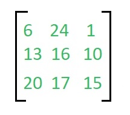
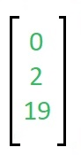
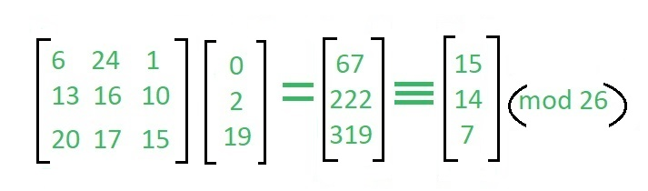
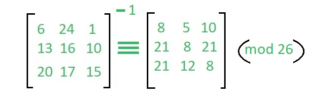
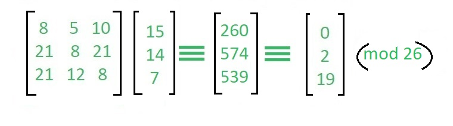
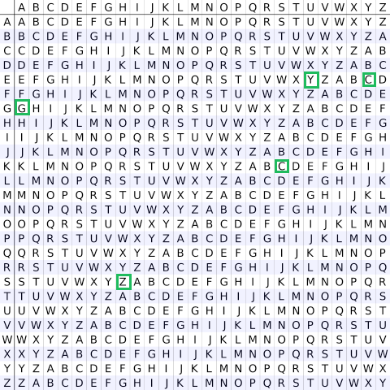

# encryption

### 1. XOR Cipher

If an integer a and any integer b are exclusive or twice, the result is the integer a itself, that is: a == a ^ b ^ b.

Here a is the original data to be encrypted, and b is the key. A ^ b is the encryption process, and the result of exclusive or is the encrypted ciphertext; a ^ b and key b exclusive or are the decryption process, and the result is the original data a itself.

    a = Original data
    b = secret key

    // One XOR, encrypted to ciphertext
    c = a ^ b

    // Second exclusive or, decrypt to get the original data (d == a)
    d = c ^ b

XOR encryption if the original and ciphertext are known at the same time, the secret key can be calculated by comparing the original and the password. Therefore, XOR encryption has low security and is generally only used for simple encryption.

### 2. Caesar Cipher

The Caesar Cipher technique is one of the earliest and simplest method of encryption technique. It’s simply a type of substitution cipher, i.e., each letter of a given text is replaced by a letter some fixed number of positions down the alphabet. For example with a shift of 1, A would be replaced by B, B would become C, and so on.

**Examples**

```text
Text : ABCDEFGHIJKLMNOPQRSTUVWXYZ
Shift: 23
Cipher: XYZABCDEFGHIJKLMNOPQRSTUVW

Text : ATTACKATONCE
Shift: 4
Cipher: EXXEGOEXSRGI
```

### 3. Hill Cipher

Hill cipher is a polygraphic substitution cipher based on linear algebra.Each letter is represented by a number modulo 26. Often the simple scheme A = 0, B = 1, …, Z = 25 is used, but this is not an essential feature of the cipher. To encrypt a message, each block of n letters (considered as an n-component vector) is multiplied by an invertible n × n matrix, against modulus 26. To decrypt the message, each block is multiplied by the inverse of the matrix used for encryption.

The matrix used for encryption is the cipher key, and it should be chosen randomly from the set of invertible n × n matrices (modulo 26).

**Examples**

```text
Input  : Plaintext: ACT
         Key: GYBNQKURP
Output : Ciphertext: POH

Input  : Plaintext: GFG
         Key: HILLMAGIC 
Output : Ciphertext: SWK
```

**Encryption**

We have to encrypt the message ‘ACT’ (n=3).The key is ‘GYBNQKURP’ which can be written as the nxn matrix:



The message ‘ACT’ is written as vector:



The enciphered vector is given as:



which corresponds to ciphertext of ‘POH’

**Decryption**

To decrypt the message, we turn the ciphertext back into a vector, then simply multiply by the inverse matrix of the key matrix (IFKVIVVMI in letters).The inverse of the matrix used in the previous example is:



For the previous Ciphertext ‘POH’:



which gives us back ‘ACT’.

https://en.wikipedia.org/wiki/Hill_cipher

### 4. Vigenère Cipher

Vigenere Cipher is a method of encrypting alphabetic text. It uses a simple form of polyalphabetic substitution. A polyalphabetic cipher is any cipher based on substitution, using multiple substitution alphabets .The encryption of the original text is done using the Vigenère square or Vigenère table.

* The table consists of the alphabets written out 26 times in different rows, each alphabet shifted cyclically to the left compared to the previous alphabet, corresponding to the 26 possible Caesar Ciphers.
* At different points in the encryption process, the cipher uses a different alphabet from one of the rows.
* The alphabet used at each point depends on a repeating keyword.

**Example**

```text
Input : Plaintext :   GEEKSFORGEEKS
             Keyword :  AYUSH
Output : Ciphertext :  GCYCZFMLYLEIM
For generating key, the given keyword is repeated
in a circular manner until it matches the length of 
the plain text.
The keyword "AYUSH" generates the key "AYUSHAYUSHAYU"
The plain text is then encrypted using the process 
explained below.
```

**Encryption**

The first letter of the plaintext, G is paired with A, the first letter of the key. So use row G and column A of the Vigenère square, namely G. Similarly, for the second letter of the plaintext, the second letter of the key is used, the letter at row E and column Y is C. The rest of the plaintext is enciphered in a similar fashion. 



**Decryption**

Decryption is performed by going to the row in the table corresponding to the key, finding the position of the ciphertext letter in this row, and then using the column’s label as the plaintext. For example, in row A (from AYUSH), the ciphertext G appears in column G, which is the first plaintext letter. Next we go to row Y (from AYUSH), locate the ciphertext C which is found in column E, thus E is the second plaintext letter.

A more _easy implementation_ could be to visualize Vigenère algebraically by converting [A-Z] into numbers [0–25].

```text
Encryption
The plaintext(P) and key(K) are added modulo 26.
Ei = (Pi + Ki) mod 26

Decryption
Di = (Ei - Ki + 26) mod 26
```

