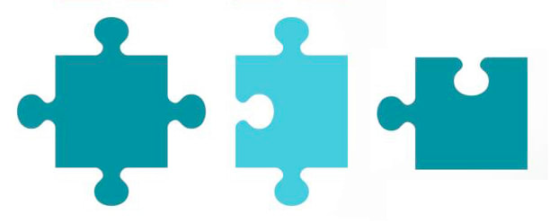

# jigsaw-puzzle

Design a program to solve a jigsaw puzzle.

###Questions and Assumptions
**1. What does a jigsaw piece look like?**
   
   In this case, all pieces will have four sides that can either have an indentation, an extrusion, or a flat edge:

**2. What does the board look like?**

Our board is a rectangle

**3. How do we know two pieces fit together?**

The curvature of the indentation on one piece will match up to the curvature of the extrusion on another.

**4. Can one piece fit with multiple pieces? **

No, the matches will be unique - one piece will only fit with one other piece.

