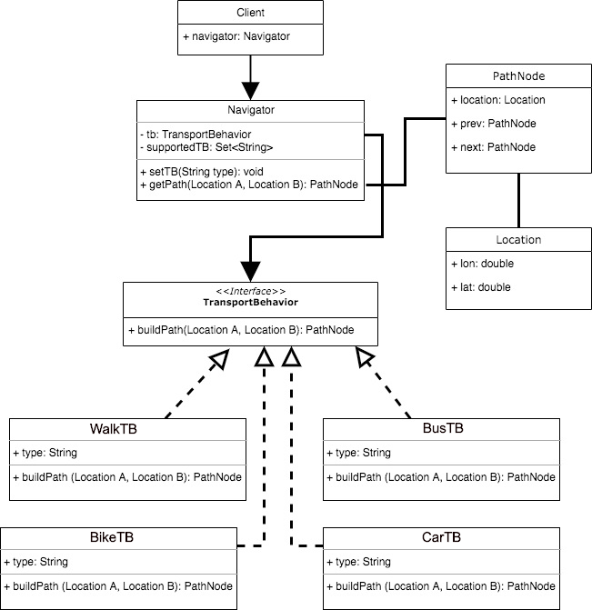

# map-navigator

Design Maps Navigator Client for different transportation types

### Requirements

* Design a maps path-building navigator client.
* User should be able to build path from point A to point B using your code.
* Your design should support different transportation methods for example: walk, car, bus, bike.

## Solution

Solution using Strategy Design Pattern:

**Navigator** is building different paths depending on what TransportBehavior it has.
WalkTB, BusTB, CarTB are different strategies (algorithms) that are being executed
when client asks Navigator to build path from Location A to Location B

**PathNode** is a node that has previous and next PathNodes in a path. (doubly linked list)
For simplicity of solution we omit implementing algorims to build Doubly linked List of PathNodes for different transplrt types.

**Location** is a latitude and longitude dot on a map

UML diagram of solution:

