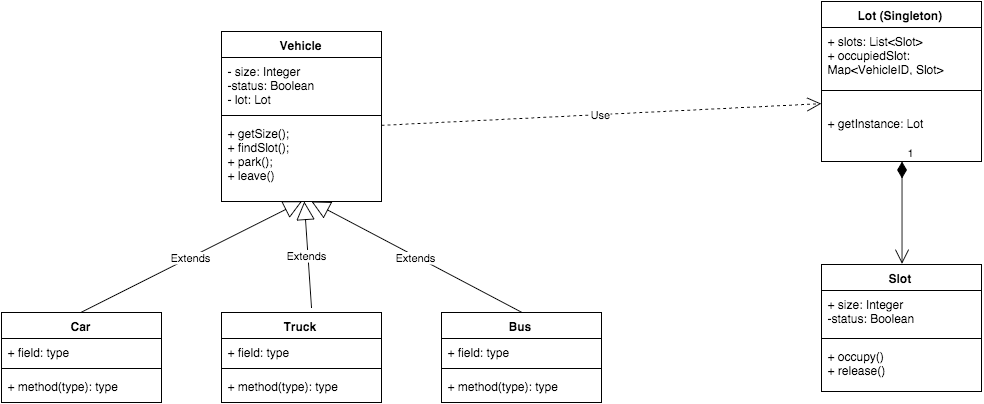

# parking-lot

### Basic Objects

* Vehicle 
  * size of vehicle (small, medium, large)
  * status of vehicle (run or parked)
* Sedan, SUV, Bus, Truck... extends Vehicle
* Slot 
  * size of slot
  * status (available or not)
* Lot
    * hold slots in lot

### Class Diagram

