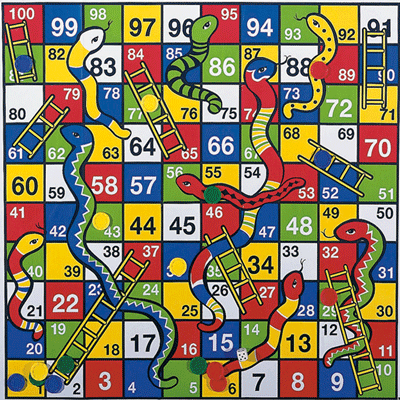

# Design a Snake Ladder Game

Create a snake and ladder game application

### Rules of the game

- The board will have 100 cells numbered from 1 to 100. 
- The game will have a six sided dice numbered from 1 to 6 and will always give a random number on rolling it.
- Each player has a piece which is initially kept outside the board (i.e., at position 0).
- Each player rolls the dice when their turn comes.
- Based on the dice value, the player moves their piece forward that number of cells. Ex: If the dice value is 5 and the piece is at position 21, the player will put their piece at position 26 now (21+5).
- A player wins if it exactly reaches the position 100 and the game ends there.
- After the dice roll, if a piece is supposed to move outside position 100, it does not move.
- The board also contains some snakes and ladders.
- Each snake will have its head at some number and its tail at a smaller number.
- Whenever a piece ends up at a position with the head of the snake, the piece should go down to the position of the tail of that snake.
- Each ladder will have its start position at some number and end position at a larger number.
- Whenever a piece ends up at a position with the start of the ladder, the piece should go up to the position of the end of that ladder.
- There could be another snake/ladder at the tail of the snake or the end position of the ladder and the piece should go up/down accordingly.

### Assumptions

- There won’t be a snake at 100.
- There won’t be multiple snakes/ladders at the same start/head point.
- It is possible to reach 100, i.e., it is possible to win the game.
- Snakes and Ladders do not form an infinite loop.

### Expectations

- Make sure that you have a working and demonstrable code
- Make sure that the code is functionally correct
- Code should be modular and readable
- Separation of concern should be addressed
- Please do not write everything in a single file
- Code should easily accommodate new requirements and minimal changes
- There should be a main method from where the code could be easily testable
- [Optional] Write unit tests, if possible
- No need to create a GUI

### Optional Requirements

- The game is played with two dice instead of 1 and so the total dice value could be between 2 to 12 in a single move.
- The board size can be customizable and can be taken as input before other input (snakes, ladders, players).
- In case of more than 2 players, the game continues until only one player is left.
- On getting a 6, you get another turn and on getting 3 consecutive 6s, all the three of those get cancelled.
- On starting the application, the snakes and ladders should be created programmatically without any user input, keeping in mind the constraints mentioned in rules.

